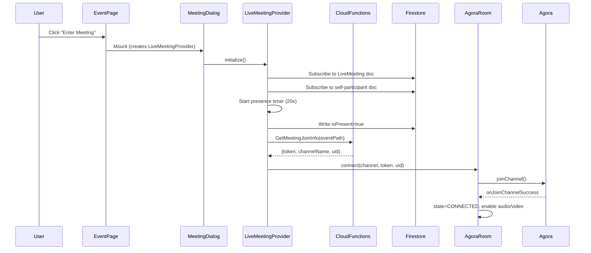
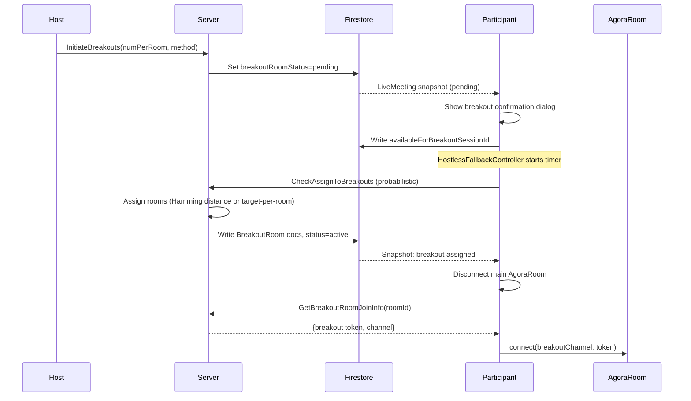

# Meeting Lifecycle

`live_meeting/` contains most of the app's interaction complexity:

- Agora video connections + recording
- Firestore real-time state synchronization
- Timers, breakout transitions, presence tracking

Coordinated through `LiveMeetingProvider` (ChangeNotifier), created when a user enters a meeting.

## Meeting States

`LiveMeetingProvider.activeUiState` derives a single enum from multiple boolean flags:

```
notJoined -> enterPrescreen -> inMeeting -> leftMeeting
                                  |
                            waitingRoom -> inMeeting
                                  |
                            breakoutRoom -> inMeeting
                                  |
                            liveStream
```

State is derived from: `_leftMeeting`, `_clickedEnterMeeting`, `isInstant`, `shouldBeInBreakout`, `shouldBeInWaitingRoom`, `shouldBeInLiveStream`.

## Meeting Join Flow



## Event Timing

| Datum                | Source                                                                        |
| -------------------- | ----------------------------------------------------------------------------- |
| Scheduled start      | `Event.scheduledTime`                                                         |
| Planned duration     | `Event.durationInMinutes`                                                     |
| Scheduled end        | Computed: `scheduledTime + durationInMinutes`                                 |
| Actual end           | `LiveMeeting.events.last.timestamp` where `.event == finishMeeting`           |
| Waiting room end     | `scheduledTime` (meeting starts at scheduled time; waiting room is pre-start) |
| Breakout duration    | Not time-bounded -- host or hostless logic ends them                          |
| Agenda item duration | `AgendaItem.durationInSeconds` (drives `_pendingMeetingGuideAgendaItemTimer`) |

**Clock sync:** `ClockService` calls `GetServerTimestamp` on app start, computes offset between client and server. All time comparisons use `clockService.now()` (adjusted) rather than `DateTime.now()`.

## Breakout Room Flow



## Agora Connection Lifecycle

**States:** `CONNECTING`, `CONNECTED`, `RECONNECTING`, `DISCONNECTED`

**Key callbacks:**

| Callback                                 | Transition      |
| ---------------------------------------- | --------------- |
| `connect()` called                       | -> CONNECTING   |
| `onJoinChannelSuccess`                   | -> CONNECTED    |
| `onConnectionStateChanged(reconnecting)` | -> RECONNECTING |
| `onConnectionStateChanged(disconnected)` | -> DISCONNECTED |
| `dispose()`                              | -> DISCONNECTED |

**Gaps:**

- No retry on DISCONNECTED (SDK internal reconnect only, ~60s timeout)
- `onTokenPrivilegeWillExpire` not handled (tokens valid ~24h, usually fine for meeting length)

## Presence Tracking

- `_presenceUpdater` (20s periodic): writes `isPresent=true` to participant doc
- RTDB `status/{uid}`: server-enforced `onDisconnect` handler sets offline immediately on TCP drop
- `UpdatePresenceStatus` trigger: propagates RTDB offline -> Firestore participant doc
- Staleness detection: server can consider a participant gone if last presence write is >~40s old
- Other participants observe via Firestore listener on participant docs

## Timers Active During Meeting

| Timer                                 | Interval             | Purpose                               |
| ------------------------------------- | -------------------- | ------------------------------------- |
| `_presenceUpdater`                    | 20s                  | Heartbeat presence write              |
| `_scheduledStartTimer`                | one-shot             | UI rebuild at meeting scheduled start |
| `_meetingStartTimer`                  | one-shot             | End waiting room after duration       |
| `_checkAssignToBreakoutsTimer`        | one-shot             | Check breakout readiness              |
| `HostlessActionFallbackController`    | configurable         | Probabilistic server-action trigger   |
| `_pendingMeetingGuideAgendaItemTimer` | agenda item duration | Auto-advance agenda                   |
| `participantInitializationTimers`     | 4s per user          | "User joined" notification delay      |

## Disconnect and Reconnect

- **Agora:** SDK retries internally for ~60s. No app-level retry if SDK gives up.
- **Firestore:** SDK reconnects listeners automatically; each listener re-reads its full doc on reconnect.
- **Clean close** (`window.onBeforeUnload`): writes `isPresent=false`, disposes conference room.
- **Unclean close** (crash, network loss): RTDB `onDisconnect` fires server-side, trigger updates Firestore.
- **Latency:** RTDB disconnect detection is near-instant for TCP drops; for WiFi loss without TCP close, ~60-90s.

## Recording

`RecordingSession` doc tracks status: `starting` -> `recording` -> `stopping` -> `stopped` -> `failed`.

On `stopped`: `produceSessions` (JS Firestore trigger) downloads the recording from Agora cloud storage to Firebase Storage.

Recording uses a separate Agora channel subscription (cloud recording UID joins the channel as a non-publishing participant).

## Orthogonal State Axes

These dimensions change independently during a meeting:

| Axis             | Values                                  | Owner                            |
| ---------------- | --------------------------------------- | -------------------------------- |
| Meeting phase    | prescreen / inMeeting / breakout / left | LiveMeetingProvider              |
| Audio            | muted / unmuted / disabled              | AgoraParticipant                 |
| Video            | off / on / disabled                     | AgoraParticipant                 |
| Network quality  | good / degraded / poor                  | AgoraParticipant (5s poll)       |
| Recording        | off / starting / recording / stopping   | RecordingSession doc             |
| Hand raised      | yes / no                                | ConferenceRoom                   |
| Dominant speaker | speaking / not                          | ConferenceRoom (debounced 500ms) |
