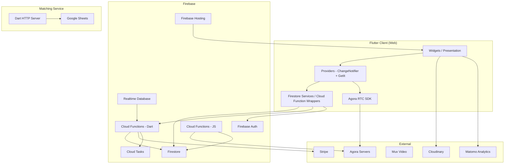

# Architecture

## System Diagram



## Deployed Components

| Component              | Runtime                         | Location                   | Purpose                                             |
| ---------------------- | ------------------------------- | -------------------------- | --------------------------------------------------- |
| Flutter client         | Browser (Flutter Web)           | `client/`                  | User-facing app                                     |
| Cloud Functions (Dart) | Node.js (dart2js)               | `firebase/functions/`      | Business logic, Firestore triggers, scheduled tasks |
| Cloud Functions (JS)   | Node.js                         | `firebase/functions/node/` | Recording, transcription, SSR                       |
| Matching service       | Dart HTTP (functions_framework) | `matching/`                | Survey-based participant matching                   |
| Shared data models     | Library (no runtime)            | `data_models/`             | Freezed types shared between client and functions   |

## Client Feature Structure

```
client/lib/
  config/          -- Environment, Firebase options
  core/
    data/services/ -- Firestore, CloudFunctions, Analytics, Clock, Logging
    localization/  -- Locale management
    routing/       -- Beamer locations
    utils/         -- Platform, error, stream utilities
    widgets/       -- Shared UI components (navbar, buttons, fields)
  features/
    admin/         -- Stripe billing, agreements, data export
    announcements/ -- Community announcements
    auth/          -- Sign-in flows
    chat/          -- Real-time chat (event and breakout)
    community/     -- Community CRUD, membership, permissions
    discussion_threads/ -- Forum-style threads
    events/        -- Event scheduling, event page, live meeting
      features/
        create_event/   -- Event creation dialog
        event_page/     -- Event detail and participant management
        live_meeting/   -- Video meeting (Agora, breakouts, recording)
          data/providers/    -- LiveMeetingProvider, ConferenceRoomNotifier
          features/video/    -- AgoraRoom, ConferenceRoom, participant views
          features/meeting_guide/ -- Agenda card, polls, word clouds
          features/meeting_agenda/ -- User-submitted agenda items
          features/breakout_room_definition/ -- Breakout config UI
          features/live_stream/ -- Livestream mode
          features/admin_panel/ -- Host controls
    home/          -- Home page, community discovery
    resources/     -- Community resource links
    templates/     -- Event template CRUD
    user/          -- User profile, settings, auth services
  app.dart         -- App widget, Firebase init, Sentry, root providers
  services.dart    -- GetIt singleton registration (30+ services)
  main.dart        -- Entry point (calls runClient())
```

## State Management

**Pattern:** GetIt (service locator) + Provider (ChangeNotifier in widget tree)

- **GetIt singletons** (`services.dart`): 30+ services registered eagerly in `createServices()` -- Firestore services, cloud function wrappers, analytics, user service, clock, logging
- **Root providers** (`app.dart`): UserService, UserDataService, DialogProvider, FirestoreDatabase, NavBarProvider, LocaleProvider
- **Per-route providers**: Created in widget `static create()` factories (e.g., `EventPage.create()` wraps in `ChangeNotifierProvider(create: EventProvider(...))`)
- **Reactive streams**: `BehaviorSubjectWrapper` wraps Firestore `.snapshots()` in an RxDart `BehaviorSubject`, caching last value. Starts listening immediately on construction (eager, not lazy).

## Data Model Hierarchy

```
Community (has displayIds, settings, feature flags)
  +-- Template (defines event structure/agenda)
       +-- Event (scheduled instance; status: active/canceled; type: hosted/hostless/livestream)
            +-- Participants (status: active/canceled/banned; isPresent, breakout assignment)
            +-- LiveMeeting (runtime state: events timeline, breakout session, recording)
                 +-- BreakoutRoomSession (pending -> processingAssignments -> active -> inactive)
                 +-- BreakoutRooms (participantIds, flagStatus)
            +-- ParticipantAgendaItemDetails (polls, suggestions, hand raises)
```

## Firestore Collections

**Top-level:** `community`, `publicUser`, `privateUserData`, `memberships`, `community-tag-definitions`, `external-partners`, `partner-agreements`, `stripeUserData`, `plan-capability-lists`, `recording-sessions`

**Under `community/{id}`:** `templates`, `discussion-threads`, `chats`, `featured`, `announcements`, `community-resources`, `community-tags`, `join-requests`

**Under `templates/{id}`:** `events`

**Under `events/{id}`:** `event-participants`, `chats`, `event-messages`, `user-suggestions`, `live-meetings`, `private-live-stream-info`

**Under `live-meetings/{id}`:** `breakout-room-sessions/{sid}/breakout-rooms/{rid}/live-meetings/{id}` (with `chats/messages`, `proposals`, `user-suggestions`, `participant-agenda-item-details`)

**Realtime Database:** `status/{uid}` (user presence: online/offline)

## Routing

Uses **Beamer** with `BeamLocation` subclasses:

| Route                                            | Location Class       | Key Providers Created                              |
| ------------------------------------------------ | -------------------- | -------------------------------------------------- |
| `/home`                                          | HomeLocation         | --                                                 |
| `/space/:displayId`                              | CommunityLocation    | CommunityProvider                                  |
| `/space/:displayId/discuss/:templateId/:eventId` | CommunityLocation    | EventProvider, TemplateProvider, EventPageProvider |
| `/space/:displayId/instant`                      | CommunityLocation    | (instant meeting flow)                             |
| `/space/:displayId/admin`                        | CommunityLocation    | (admin panels)                                     |
| `/settings`                                      | UserSettingsLocation | --                                                 |
| `/newspace`                                      | NewSpaceLocation     | --                                                 |
